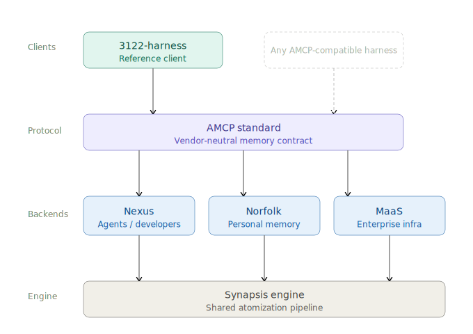

# 3122

**EN**: `3122` is an AMCP-native, model-neutral coding harness.  
**KO**: `3122`는 AMCP 네이티브, 모델 중립 코딩 하네스입니다.

It is not a standalone memory product. It is the reference client layer in the broader Synapsis ecosystem.  
단독 메모리 제품이 아니라, 더 큰 Synapsis 생태계 안에서 동작하는 레퍼런스 클라이언트 레이어입니다.

## Memory Ecosystem | 메모리 생태계



## Ecosystem | 생태계

**EN**: The current ecosystem is organized like this.  
**KO**: 현재 제품군은 아래처럼 나뉩니다.

| Product | English role | 한국어 역할 |
| --- | --- | --- |
| `Synapsis Engine` | Shared runtime and orchestration layer across the ecosystem | 생태계 전반의 공통 런타임 및 오케스트레이션 레이어 |
| `AMCP` | Vendor-neutral memory contract | 벤더 중립 메모리 계약 / 표준 |
| `Nexus` | Reference AMCP backend for agents and developers | 에이전트와 개발자를 위한 레퍼런스 AMCP 백엔드 |
| `Norfolk` | Personal lifetime memory backend | 개인용 평생 메모리 백엔드 |
| `MaaS` | Enterprise memory infrastructure | 엔터프라이즈 메모리 인프라 |
| `3122-harness` | Reference client and coding harness | 레퍼런스 클라이언트이자 코딩 하네스 |

**EN**: In short, Synapsis Engine is the shared runtime layer, AMCP is the contract, Nexus is the first reference backend, Norfolk is the personal memory backend, MaaS is the enterprise deployment model, and `3122-harness` is the client that proves the contract can power real agent workflows.  
**KO**: 한 줄로 말하면, Synapsis Engine은 공통 런타임 레이어이고, AMCP는 계약이며, Nexus는 첫 레퍼런스 백엔드, Norfolk는 개인 메모리 백엔드, MaaS는 엔터프라이즈 배포 모델, `3122-harness`는 그 계약이 실제 에이전트 작업 흐름을 감쌀 수 있음을 보여주는 클라이언트입니다.

## What 3122 Is | 3122의 자리

**EN**:
- terminal-first coding harness
- local-first by default
- model-neutral across API and local model providers
- AMCP portable memory client
- continuity runtime for coding sessions, handoff, and verification

**KO**:
- 터미널 중심 코딩 하네스
- 기본값은 로컬 우선
- API 모델과 로컬 모델을 모두 감싸는 모델 중립 런타임
- AMCP portable memory 클라이언트
- 코딩 세션, handoff, verification을 위한 continuity 런타임

**EN**: 3122 owns the harness layer: prompts, permissions, tool execution, session continuity, and backend selection.  
**KO**: 3122는 하네스 레이어를 담당합니다. 프롬프트, 권한, 도구 실행, 세션 연속성, 백엔드 선택이 여기에 있습니다.

**EN**: Retrieval alone is not memory. `3122-harness` treats similarity recall as one capability inside a larger memory architecture that also needs continuity, portability, and backend swapability.  
**KO**: retrieval만으로는 memory가 아닙니다. `3122-harness`는 similarity recall을 더 큰 메모리 구조 안의 한 기능으로 보고, continuity, portability, backend 교체 가능성까지 함께 다룹니다.

**EN**:
- the harness owns context management and prompt budgeting
- the memory backend owns persistence and recall
- AMCP prevents lock-in between them

**KO**:
- 하네스는 context 관리와 prompt budget을 담당합니다
- memory backend는 persistence와 recall을 담당합니다
- AMCP는 둘 사이의 lock-in을 막습니다

## What 3122 Is Not | 3122가 아닌 것

**EN**:
- not a hosted memory backend by itself
- not a note app
- not a clone of Claude Code, Codex, or Aider
- not the AMCP spec itself

**KO**:
- 자체가 hosted memory 백엔드는 아닙니다
- 노트 앱도 아닙니다
- Claude Code, Codex, Aider의 복제도 아닙니다
- AMCP 스펙 그 자체도 아닙니다

## Memory Architecture | 메모리 구조

**EN**: 3122 separates continuity state from portable memory.  
**KO**: 3122는 continuity 상태와 portable memory를 분리합니다.

### Continuity Runtime State | 연속성 런타임 상태

**EN**: These stay local and operational.  
**KO**: 이 레이어는 로컬에 남고, 운영용 상태입니다.

- `.harness/sessions/` JSONL transcripts
- `.harness/memory.db` trajectory state
- handoff snapshots
- file memory
- skill candidate detection

### Portable Memory | 이식 가능한 메모리

**EN**: Portable memory uses one AMCP item shape across backends.  
**KO**: portable memory는 백엔드가 달라도 하나의 AMCP item shape를 씁니다.

- `local-amcp`: local SQLite portable memory
- `nexus-cloud`: first hosted backend over Nexus `/v1/amcp`
- `third-party-amcp`: extension slot

**EN**: `Nexus Free` / `Local Lite` is a Nexus product tier, not a current `3122` backend selector. In `3122`, local memory still means `local-amcp`, while hosted Nexus memory means `nexus-cloud`.  
**KO**: `Nexus Free` / `Local Lite`는 Nexus 제품 플랜 이름이지 현재 `3122` backend 선택자가 아닙니다. `3122`에서 로컬 메모리는 계속 `local-amcp`이고, hosted Nexus 메모리는 `nexus-cloud`입니다.

**EN**: This means local export, import, and backend migration are based on one portable record contract instead of a harness-only format.  
**KO**: 그래서 로컬 export, import, backend migration이 하네스 전용 포맷이 아니라 하나의 portable record 계약 위에서 동작합니다.

**EN**: Memory should survive tool changes, backend changes, and workspace rebuilds.  
**KO**: 메모리는 도구를 바꿔도, 백엔드를 바꿔도, 워크스페이스를 다시 만들어도 살아남아야 합니다.

## Current Status | 현재 상태

This repository currently contains:

- an architecture document in `docs/ARCHITECTURE.md`
- a Rust workspace scaffold
- a project-level `harness.toml`
- a small `harness` CLI with `repl`, `doctor`, `config`, `providers`, `blueprint`, `skills`, `mcp`, `session`, and `tool`
- a provider and runtime blueprint in `crates/runtime`
- provider clients for Anthropic BYOK, OpenAI-compatible BYOK, and Ollama
- external adapter clients for `claude` and `codex`
- JSONL session files under `.harness/sessions/`
- SQLite-backed trajectory memory under `.harness/memory.db`
- AMCP-native portable memory records stored alongside trajectory state in `.harness/memory.db`
- built-in tool surfaces for `read`, `write`, `edit`, `grep`, `glob`, and `exec`
- skill discovery across project and user skill folders
- skill resolution and prompt-packet generation through `skills show/run` and `/skill`
- MCP discovery plus stdio tool listing/calls through `mcp tools/call`
- a tested agent loop that can request built-in tools, skills, and MCP calls through a provider-agnostic tool-call block
- approval gating for model-requested tools with risk-aware `prompt` and `auto` policies
- saved BYOK provider profiles with key detection and preset-based registration
- verification policy with `off`, `annotate`, and `require`
- prompt context with recent history, local memory recall, relevant conversation recall, and a context budget cap
- routing-friendly skill summaries with a short summary budget
- read-only `parallel_read` batching for one-turn discovery
- provider-native tool calling for Anthropic, OpenAI-compatible, and Ollama with text-tool fallback
- a dedicated verifier module for task-aware verification that requires checks after the last code mutation while exempting docs-only edits
- project-aware verifier suggestions that inspect workspace manifests such as `Cargo.toml`
- automatic model-switch handoff snapshots with first-turn context boost
- trajectory indexing that compresses work into goal, attempt, failure, verification, and next-step state
- repeated workflow detection with promotable skill candidates
- `nexus-cloud` hosted memory transport over the Nexus `/v1/amcp` surface
- runtime unit tests covering config, permissions, providers, skills, MCP, the harness loop, and verifier behavior
- env-gated live provider tests for Anthropic, OpenAI-compatible, and Ollama
- more readable CLI status, memory, approval, and verification feedback
- compact prompt shaping for weaker local and open-weight model families such as Ollama, Qwen, Llama, Gemma, Mistral, Phi, and DeepSeek
- model-aware context budget profiles with compact recall limits for smaller model families
- runtime `api/auth/auto` target resolution for interactive and one-shot modes
- a full-screen terminal REPL with a fixed bottom input bar and live slash-command suggestions

Planning is fixed in [docs/ROADMAP.md](/Users/paul_k/Documents/p-23/3122/docs/ROADMAP.md).

## Install

Quick install from the latest GitHub Release:

```bash
curl -fsSL https://raw.githubusercontent.com/goldberg-aria/3122-harness/main/scripts/install.sh | bash
```

Manual source install:

```bash
git clone https://github.com/goldberg-aria/3122-harness.git
cd 3122-harness
cargo install --path crates/cli --force
```

After install, run the harness directly:

```bash
3122
```

Notes:

- `3122` without subcommands starts the terminal REPL
- `cargo run -p cli -- ...` is the development path when running from the repo without installing
- GitHub Releases publish `.tar.gz` archives for Linux x64, macOS Intel, and macOS Apple Silicon when a `v*` tag is pushed
- `scripts/install.sh` downloads the latest matching release asset for the current machine
- package-manager distribution is not wired yet in this repo

## Commands

```bash
3122
3122 doctor
3122 config
3122 model show
3122 model set-primary openai/gpt-4.1-mini
3122 memory
3122 memory show 1
3122 memory recall 6
3122 memory save
3122 memory search provider
3122 memory sessions
3122 memory session file:///absolute/path/to/.harness/sessions/session-123.jsonl
3122 memory delete --id amcp-example-id
3122 memory export --format amcp-jsonl --output memory-export.jsonl
3122 memory import --format amcp-jsonl --input memory-export.jsonl
3122 memory migrate --from local-amcp --to nexus-cloud
3122 trajectory
3122 trajectory active
3122 trajectory search provider
3122 resume
3122 handoff
3122 handoff debug
3122 why-context
3122 commands
3122 commands show recap
3122 commands init
3122 commands new checkpoint macro
3122 commands new ctx alias --global
3122 tool parallel-read '[{"tool":"read","path":"README.md"},{"tool":"glob","pattern":"src/*.rs"}]'
3122 prompt "say hello"
3122 providers
3122 providers presets
3122 providers detect-key <api-key>
3122 providers add router --api-key <api-key>
3122 providers sync-env
3122 providers saved
3122 blueprint
3122 skills
3122 skills suggest
3122 skills promote 1
3122 skills show project-bootstrap
3122 skills run project-bootstrap "start the first runtime slice"
3122 mcp
3122 mcp tools mock-echo
3122 mcp call mock-echo echo '{"text":"hello"}'
3122 session latest
3122 tool read README.md
```

## Hosted memory

`nexus-cloud` is the first hosted portable memory backend.
It uses the same AMCP item shape as `local-amcp` and talks to Nexus over `/v1/amcp`.

**EN**: Today, Nexus is the first hosted backend. Norfolk and MaaS are ecosystem targets, but they are not the first 3122 transport target in this phase.  
**KO**: 현재는 Nexus가 첫 hosted backend입니다. Norfolk와 MaaS도 같은 생태계 대상이지만, 이번 phase에서 3122의 첫 transport 대상은 아닙니다.

Example config:

```toml
[memory]
backend = "nexus-cloud"
dual_write_legacy_jsonl = true
auto_promote_policy = "suggest"

[memory.nexus_cloud]
endpoint = "https://nexus-api.example.com"
api_key_env = "NEXUS_API_KEY"
namespace = "workspace-default"
```

Runtime rules:

- the endpoint is the API host, not the web host
- the raw key stays in the environment variable named by `api_key_env`
- hosted backends may advertise optional AMCP capabilities through `/v1/amcp/capabilities`
- `memory migrate --from local-amcp --to nexus-cloud` moves portable AMCP items only
- transcripts and trajectory continuity remain local runtime state
- strengthening source of truth: `docs/AMCP_MEMORY_STRENGTHENING_DIRECTIVE_2026-04-13.md`
- `3122` does not currently expose a dedicated `nexus-local` backend or enforce Nexus Free / Local Lite plan rules in local mode

### Connect 3122 To Nexus

`3122` already speaks the Nexus AMCP surface through `nexus-cloud`.

Use this when you want hosted Nexus memory with an account and API key.
If you want local no-signup memory inside `3122`, stay on `local-amcp`.

Use this setup:

```toml
[memory]
backend = "nexus-cloud"
dual_write_legacy_jsonl = true
auto_promote_policy = "suggest"

[memory.nexus_cloud]
endpoint = "https://<nexus-api-host>"
api_key_env = "NEXUS_API_KEY"
namespace = "workspace-default"
```

```bash
export NEXUS_API_KEY=...
```

Then verify with:

```bash
cargo run -p cli -- memory save
cargo run -p cli -- memory recall 6
cargo run -p cli -- memory sessions
cargo run -p cli -- memory export --format amcp-jsonl --output memory-export.jsonl
cargo run -p cli -- memory migrate --from local-amcp --to nexus-cloud
```

Expected behavior:

- `memory save` writes AMCP items to Nexus through `/v1/amcp/remember`
- `memory recall` reads portable recall through `/v1/amcp/recall`
- `memory sessions` and `memory session <key>` read hosted session state
- export/import/migrate preserve the same AMCP item shape

Current status:

- `nexus-cloud` support is implemented in code
- contract tests for the Nexus `/v1/amcp` surface pass
- `local-amcp` remains the default no-signup backend
- `Nexus Free` / `Local Lite` is currently a Nexus plan label, not a `3122` backend name
- `nexus-local` is not implemented
- on April 13, 2026, live smoke passed against a real Nexus endpoint from this workspace
- verified commands: `memory save`, `memory search`, `memory recall`, `memory sessions`, `memory session`, and `memory export`
- current Nexus deployments may return `404` on `/v1/amcp/capabilities`; `3122` treats that as minimal capability fallback, not as a hard failure

## Tool-call protocol

The current loop prefers provider-native tool calling when the backend supports it.

Native-tool providers use their own tool-calling interface first.
The text `<tool_call>` contract remains as the fallback path when native tools are unavailable or rejected:

```xml
<tool_call>
{"tool":"read","arguments":{"path":"README.md"}}
</tool_call>
```

Supported loop actions:

- built-in tools: `read`, `write`, `edit`, `grep`, `glob`, `exec`, `parallel_read`
- `skill`
- `mcp_list_tools`
- `mcp_call`

Provider-native tool calling:

- Anthropic, OpenAI-compatible providers, and Ollama now expose the built-in tool set as native tools when supported
- OpenAI-compatible models such as Grok are prompted to use native tool calls first instead of emitting text-only XML wrappers
- if native tool calling is unsupported or rejected, the harness falls back to the text `<tool_call>` path
- malformed `<tool_call>` fragments in an otherwise normal model answer are ignored instead of aborting the turn
- external CLI adapters still use the text tool path for now

Approval behavior:

- default policy is `[approvals].policy = "prompt"`
- `prompt` mode auto-approves low-risk tools, prompts for medium/high-risk tools, and blocks critical tools
- `auto` mode auto-approves low/medium/high-risk tools and still blocks critical tools
- REPL supports `/approval`, `/approval prompt`, `/approval auto`
- one-shot `prompt` only fails when a request would have prompted or been denied

Provider connection policy:

- `[providers].default_connection_mode = "api"` is the fixed default
- `[providers].interactive_connection_mode = "auto"` is the fixed interactive default
- `api` means use BYOK/API lanes first
- `auth` means prefer authenticated adapters such as `claude-code/...` and `codex/...`
- `auto` means prefer API when a configured key/profile exists, otherwise use an auth adapter when the route supports it
- runtime resolution now honors this policy
- current route policy:
  - Claude: `api` and `auth`
  - OpenAI/Codex: `api` and `auth`
  - Z.AI: `api` first
  - MiniMax: `api` first
  - Groq / Qwen API / other OpenAI-compatible routes: `api` first
  - Ollama: local API only
- the CLI now auto-loads `.env` and `.env.local` from the workspace root

Verification behavior:

- default verification policy comes from `[verification].policy`
- verification must happen after the last workspace mutation to count
- docs-only edits do not force a verification step
- verification logic is centralized in a dedicated verifier module
- `require` rejects completion after relevant workspace mutations unless a verification step was recorded or the model explicitly says `Not verified`
- `annotate` prefixes the final answer with `Not verified` plus task-aware guidance
- `off` disables verification enforcement

REPL shape:

- the base flow is closer to Codex/Claude-style slash commands
- the default interactive shell now opens in a cleared alternate screen
- the input line stays pinned to the bottom of the terminal
- typing `/` shows matching slash commands above the input line
- primary session commands are `/status`, `/model`, `/login`, `/memory`, `/resume`, `/handoff`, `/why-context`, `/approval`, `/doctor`
- trajectory commands are `/trajectory`, `/trajectory active`, `/trajectory show <index>`, `/trajectory search <query>`
- custom slash commands are loaded from `~/.harness/commands/*.toml` and `.harness/commands/*.toml`
- built-in shortcut commands are always available first, then `global`, then `workspace`
- workspace commands override global commands with the same name
- `/model <spec>` switches the active model, stores a handoff snapshot, and prints a short active/previous/next summary
- `/parallel-read <json-array>` batches read-only discovery work in one turn
- `/status` shows the current connection mode and behavior
- `/commands` lists discovered custom slash commands
- `/commands show <name>` prints the resolved command definition
- `commands init [--global]` creates the command directory if needed
- `commands new <name> [alias|macro|prompt-template] [--global]` writes a starter template

Custom slash command format:

```toml
description = "Save memory, show resume, and print the current handoff"
kind = "macro"
usage = "/recap"
steps = ["/memory save", "/resume", "/handoff"]
```

Supported kinds:

- `alias`
- `macro`
- `prompt-template`

Built-in shortcuts:

- `/ctx` -> `/why-context`
- `/mem` -> `/memory`
- `/sum` -> `/resume`
- `/hf` -> `/handoff`
- `/models` -> `/model`
- `/check` -> `/doctor`
- `/checkpoint` -> `/memory save` + `/resume` + `/handoff`

Template placeholders:

- `{args}` for the full raw argument string
- `{arg1}`, `{arg2}`, ... for positional arguments
- optional `usage = "/name <required> [optional]"` is shown in `commands show` and validation errors
- optional `min_args` and `max_args` let a command fail early with a clear usage message

Local memory:

- `memory save` promotes the latest session into AMCP-native portable memory
- trajectory state is stored in `.harness/memory.db`
- portable memory uses one AMCP item shape across local and hosted backends
- `[memory].backend` selects `local-amcp`, `nexus-cloud`, or `third-party-amcp`
- `Nexus Free` / `Local Lite` is not a separate `3122` backend selector today
- `[memory].dual_write_legacy_jsonl = true` keeps `.harness/memory/*.jsonl` compatibility files during migration
- `[memory].auto_promote_policy = suggest` stores trajectory-derived AMCP candidates without auto-writing them
- `trajectory` lists recent compressed work trajectories
- `trajectory active` shows the current active trajectory with files, failure, and verification hints
- `trajectory search <query>` runs local FTS search across stored trajectories
- prompt context now includes file-level memory when the current query or active trajectory points at specific files
- `memory` lists recent memory records
- `memory show <index>` prints one saved memory record with tags and source session
- `memory candidates` lists pending auto-promotion candidates from continuity state
- `memory promote <index>` writes one pending candidate into portable memory
- `memory dismiss <index>` clears one pending candidate without storing it
- `memory sessions` lists portable memory sessions from the selected backend
- `memory session <session-key>` prints the portable memory items attached to one session
- `memory recall [limit]` prints the exact recall block the harness would inject
- `memory search <query>` searches saved memory locally
- `memory delete --id <memory-id>` deletes one or more AMCP items by id
- `memory export --format amcp-jsonl` exports portable memory in AMCP JSONL
- `memory import --format amcp-jsonl` imports portable memory into the selected backend
- `memory migrate --from <backend> --to <backend>` moves AMCP items between backends
- `resume` and `handoff` render session and handoff state back into operator-friendly text
- `handoff debug` shows the latest structured handoff snapshot plus pending boost state
- `why-context` prints the exact runtime context injected before a model turn
- REPL exit autosaves new local memory records for the current session
- prompt context now includes recent working history, local portable memory recall, and relevant conversation recall from older sessions
- local portable recall now prioritizes the active trajectory over older free-form memory records
- `why-context` now explains why the current recall set was selected
- the first prompt after `/model <spec>` gets a temporary handoff boost in prompt context
- prompt context is budgeted so long sessions degrade conversation recall first, then memory, recent history, and finally instructions
- `/status` shows approval and verification behavior alongside provider and memory state
- `/memory` shows per-kind counts plus the most recent records

Skill summaries:

- discovered skills now expose a routing-friendly summary capped to about 250 characters
- frontmatter `description:` is preferred when present
- repeated tool workflows are tracked as skill candidates
- read-only browsing loops are filtered out so low-value candidates are not suggested
- `skills suggest` lists candidates with repeated occurrence counts
- `skills promote <index>` turns a candidate into a prompt-template slash command in `.harness/commands/`

Saved provider profiles:

- `providers add` stores BYOK profiles in `.harness/providers.json`
- auto-detection currently recognizes some key formats such as OpenRouter and OpenAI
- manual registration supports presets such as `xai`, `deepseek`, `dashscope-cn`, `dashscope-intl`, `siliconflow`, `groq`, `minimax`, `deepinfra`, and `zai-coding`
- saved profiles can be used as `profile/<alias>/<model>`
- `providers sync-env` saves env-backed profiles such as `anthropic-api`, `openai-api`, `groq`, `qwen-api`, `zai`, `minimax`, and `deepinfra`

Grok / xAI coding:

- `3122` can use Grok through the OpenAI-compatible lane
- add a saved profile with `providers add xai --api-key <XAI_API_KEY> --preset xai`
- use `profile/xai/grok-4.20-reasoning` for higher-quality coding turns
- use `profile/xai/grok-4-1-fast-reasoning` for lower-latency coding turns
- REPL and one-shot prompt flows now prefer native OpenAI-compatible tool calls for Grok, with text-tool fallback only when needed
- example:

```bash
cargo run -p cli -- providers add xai --api-key <XAI_API_KEY> --preset xai
cargo run -p cli -- prompt --model profile/xai/grok-4.20-reasoning "read README.md and summarize the provider architecture"
cargo run -p cli -- repl
```

What to prepare:

- Claude API key if you want the API lane
- OpenAI API key if you want the API lane
- Z.AI API key and the base URL you want to standardize on
- MiniMax API key and the compatibility mode you want to use first
- DeepInfra API key if you want its OpenAI-compatible lane in the matrix
- Groq and Qwen API keys if you want them in the matrix
- local Ollama models pulled in advance, at least one Gemma and one Qwen model
- authenticated CLI login for `claude` and `codex` if you want auth-lane smoke tests
- short aliases for saved profiles such as `zai`, `minimax`, `groq`, `qwen-api`

Live provider tests:

- `HARNESS_RUN_LIVE_PROVIDER_TESTS=1 cargo test --workspace`
- `OPENAI_API_KEY` enables the OpenAI-compatible live test
- `ANTHROPIC_API_KEY` enables the Anthropic live test
- `HARNESS_TEST_OLLAMA_MODEL` or `OLLAMA_HOST` enables the Ollama live test
- `HARNESS_TEST_SAVED_PROFILE_BASE_URL` and `HARNESS_TEST_SAVED_PROFILE_API_KEY` enable saved-profile live tests
- `HARNESS_RUN_AUTH_ADAPTER_TESTS=1` enables `claude-code` and `codex` auth-adapter smoke tests
- optional model overrides:
  - `HARNESS_TEST_OPENAI_MODEL`
  - `HARNESS_TEST_ANTHROPIC_MODEL`
  - `HARNESS_TEST_OLLAMA_MODEL`
  - `HARNESS_TEST_SAVED_PROFILE_ROUTE`
  - `HARNESS_TEST_SAVED_PROFILE_MODEL`
  - `HARNESS_TEST_SAVED_PROFILE_ALIAS`
  - `HARNESS_TEST_CLAUDE_CODE_MODEL`
  - `HARNESS_TEST_CODEX_MODEL`
- `scripts/run_provider_matrix.sh` syncs env-backed profiles, chooses local Ollama defaults, and runs the live smoke test suite
- current saved-profile defaults in the matrix script:
  - Z.AI: `5.1`
  - MiniMax: `2.7`
  - Groq: `openai/gpt-oss-20b`
  - Qwen API via OpenRouter: `qwen/qwen3.6-plus`
  - DeepInfra: `nvidia/Nemotron-3-Nano-30B-A3B`

## Immediate next steps

1. Add stronger REPL-level tests for status and handoff presentation.
2. Add provider-specific output shaping for external CLI adapters.
3. Add more explicit memory and handoff debugging commands.
4. Expand saved-profile presets for Z.AI, MiniMax, and Groq.
5. Add matrix scripts for the representative model suite.
